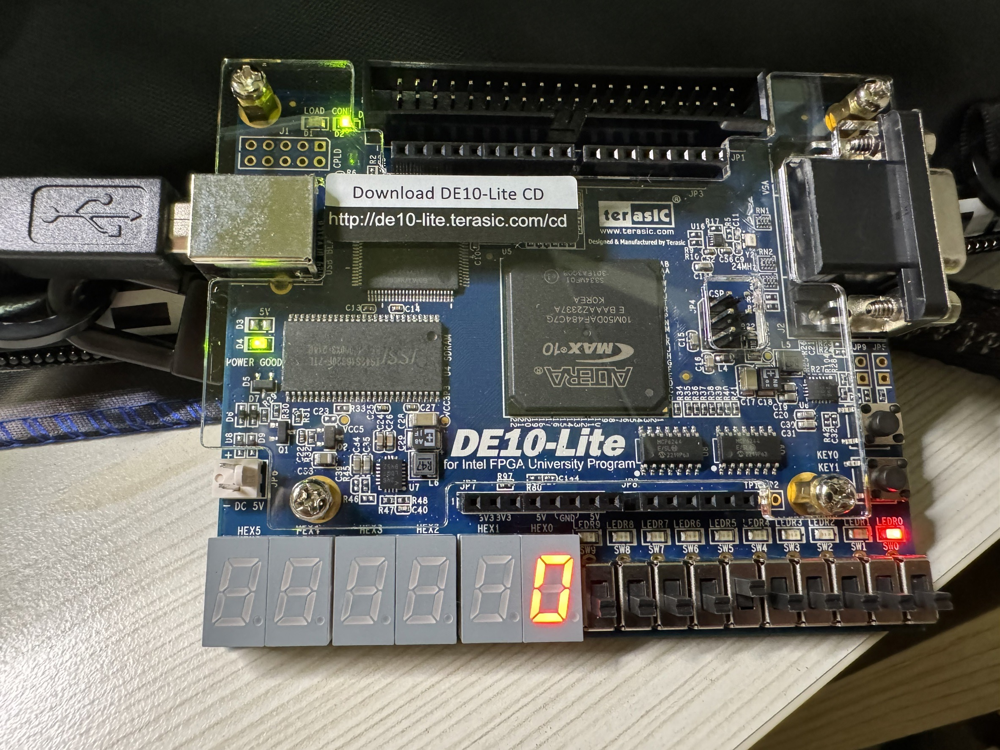
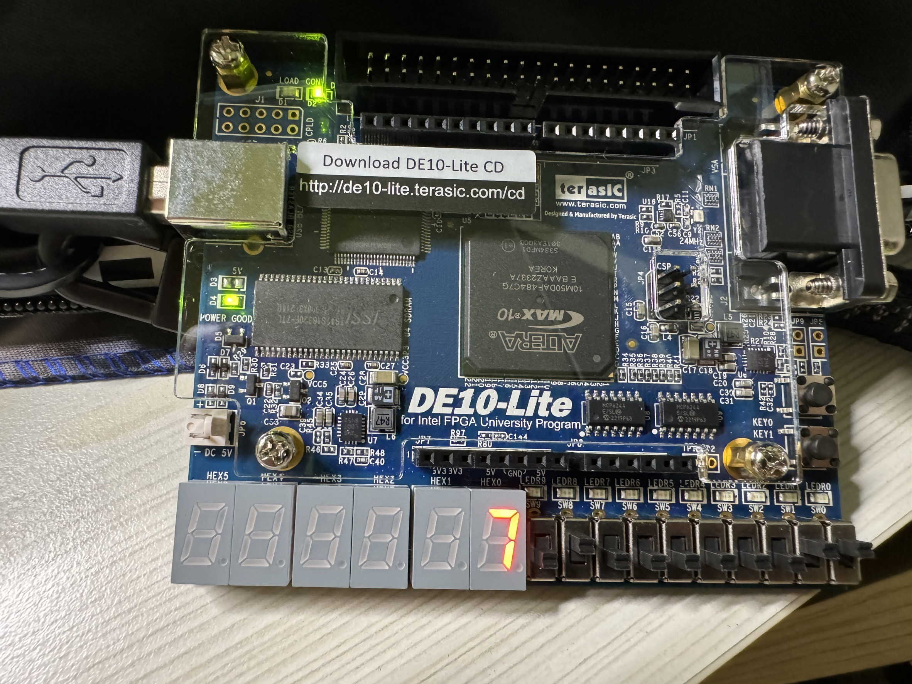
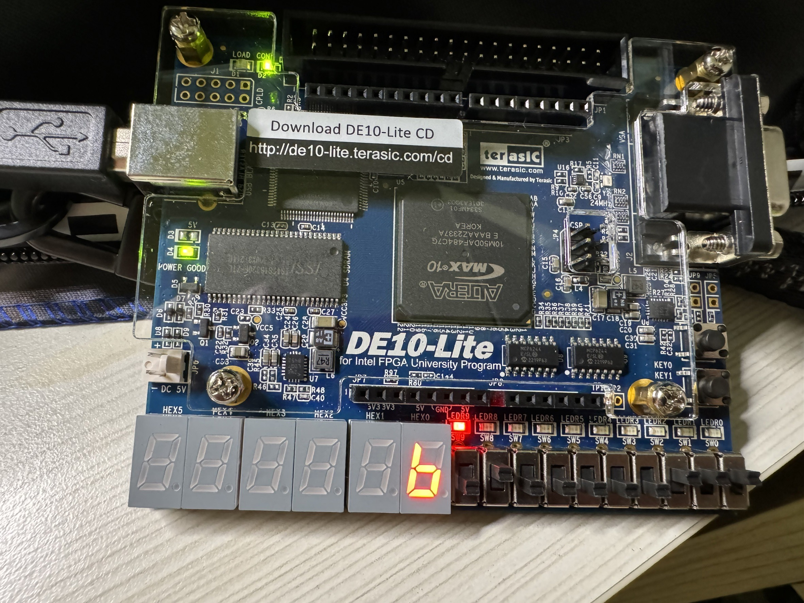
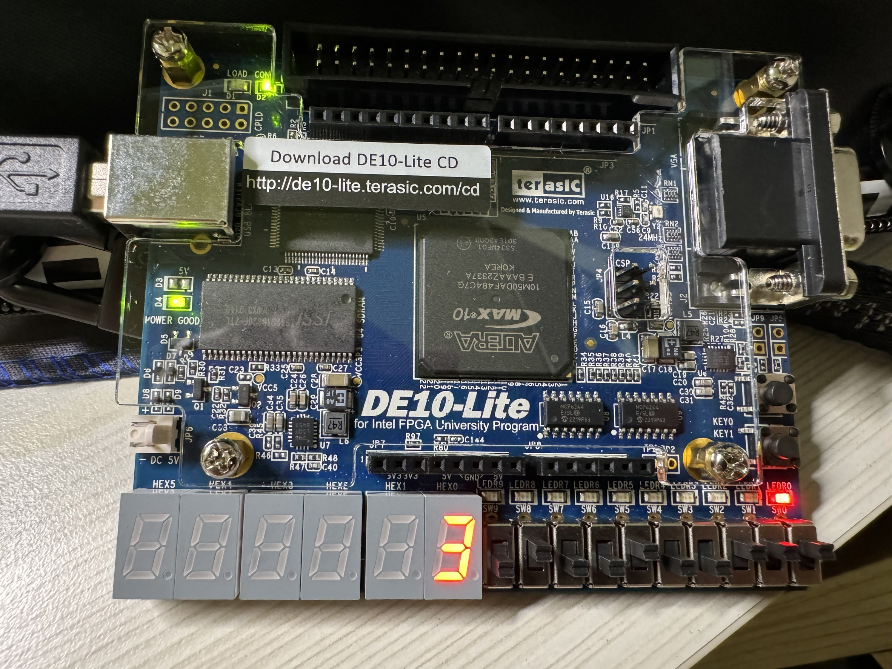
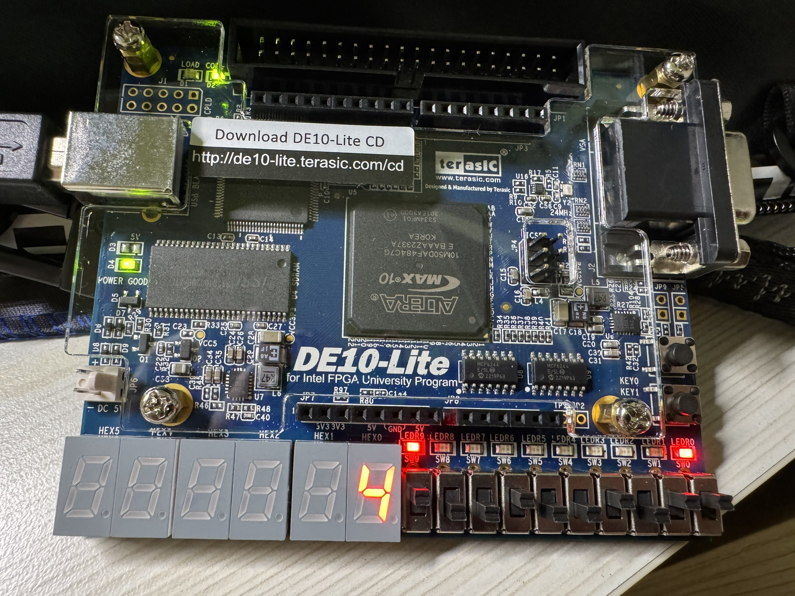
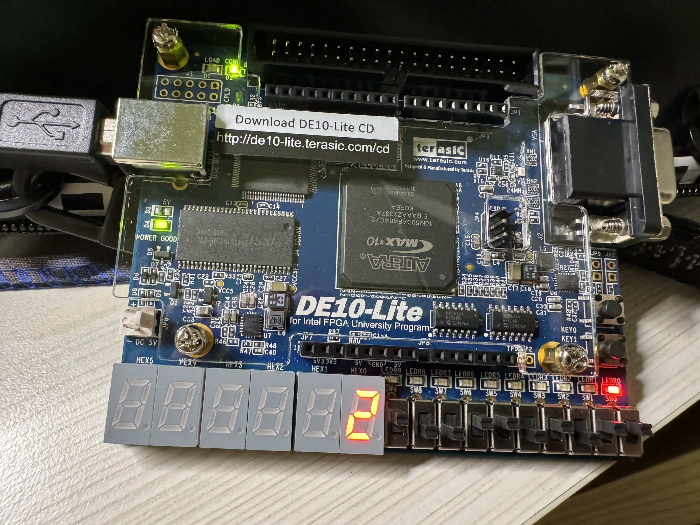

    <h1 align="center">ADDS4</h1>
    <h4 align="center">A Verilog exercise for 4-bit Adder & Subtractor on 7-Segment Display design</strong> </h4>
    

        <strong>Last updated:</strong> 12 July 2024 
        <strong>Last tested version:</strong> 0712
    
 

# About the project
I referred to the Verilog tutorial from YouTuber Merak's channel.

* A = 0000, B = 0000, M = 1, S = 0, Cout = 1, V = 0

* A = 0011, B = 0100, M = 0, S = 7, Cout = 0, V = 0

* A = 0111, B = 0100, M = 0, S = -3, Cout = 0, V = 1

* A = 0111, B = 0100, M = 1, S = 3, Cout = 1, V = 0

* A = 1011, B = 1001, M = 0, S = -4, Cout = 1, V = 1

* A = 1011, B = 1001, M = 1, S = -2, Cout = 1, V = 1
