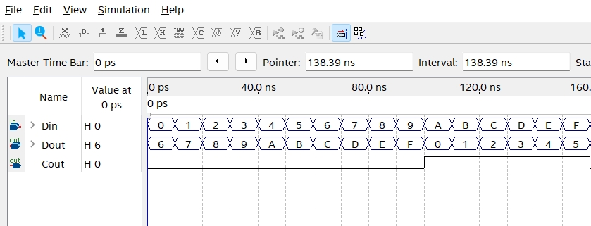
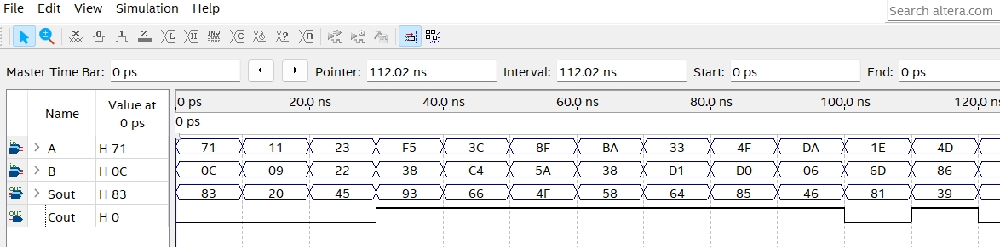
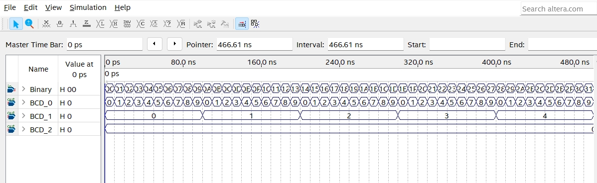

    <h1 align="center">Binary to BCD</h1>
    <h4 align="center">A Verilog exercise for Binary to BCD design</strong> </h4>
    

        <strong>Last updated:</strong> 22 Aug 2024 
        <strong>Last tested version:</strong> 0822
    
 

# About the project
I referred to the Verilog tutorial from YouTuber Merak's channel.

* ADD6

* BCDADD

* BtoBCD

[Binary to BCD](https://youtu.be/uf6MRZzVV-o)
