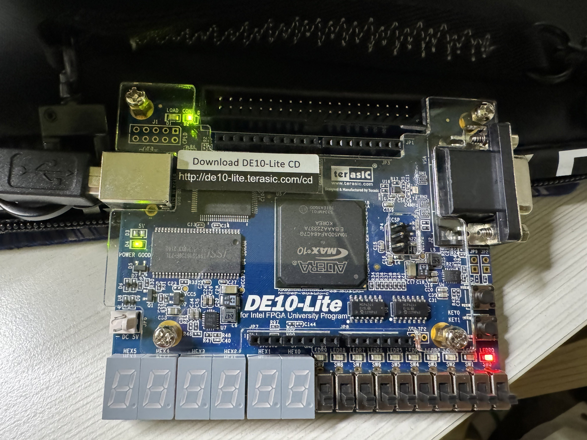
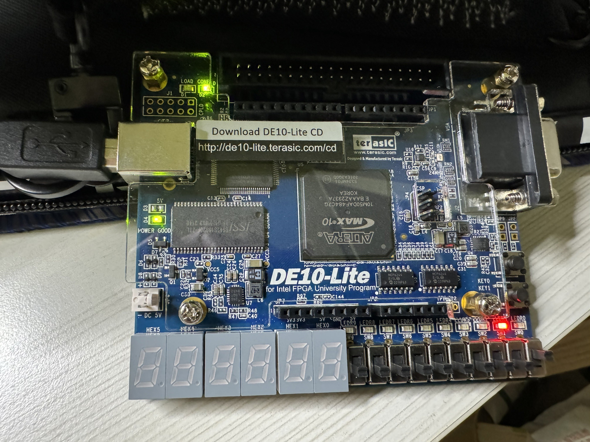
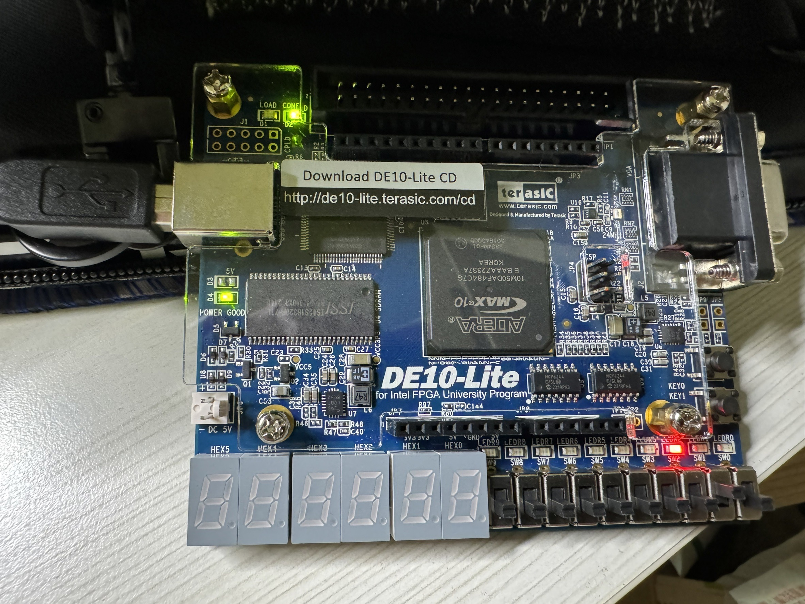
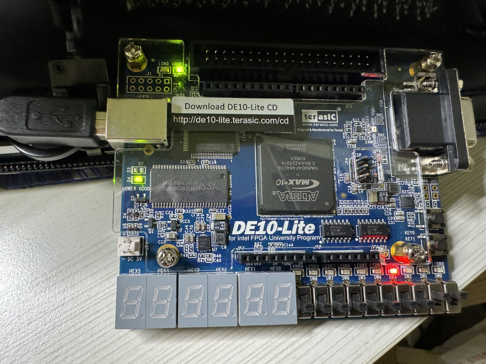
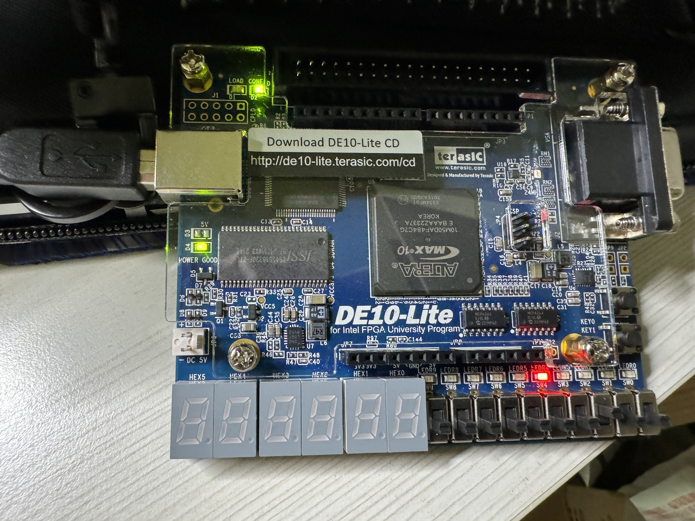
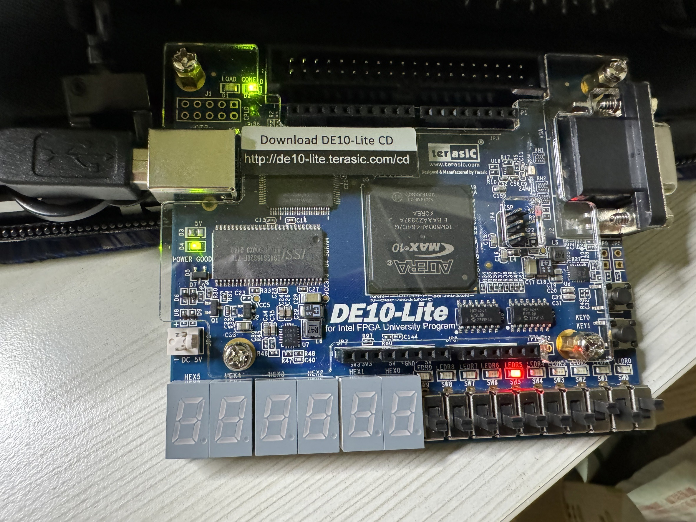
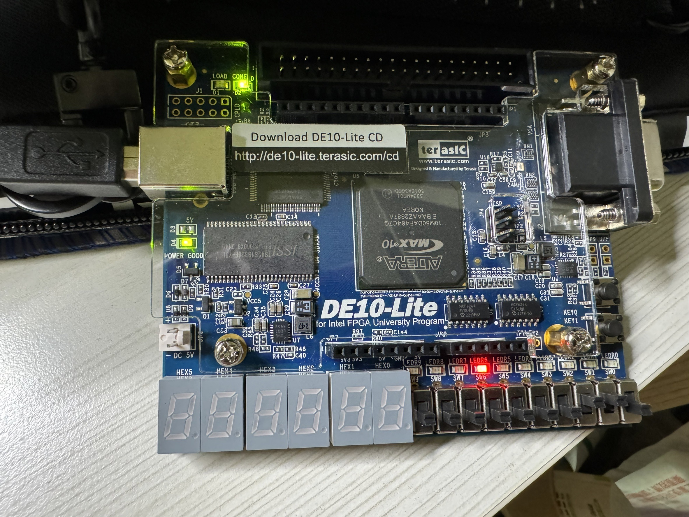
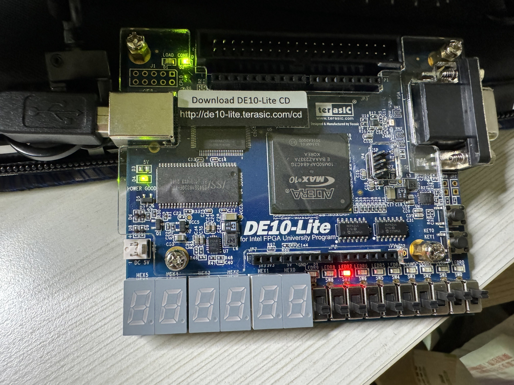

    <h1 align="center">Decoder3to8</h1>
    <h4 align="center">A Verilog exercise for Decoder3to8 design</strong> </h4>
    

        <strong>Last updated:</strong> 19 July 2024 
        <strong>Last tested version:</strong> 0719
    
 

# About the project
I referred to the Verilog tutorial from YouTuber Merak's channel.

