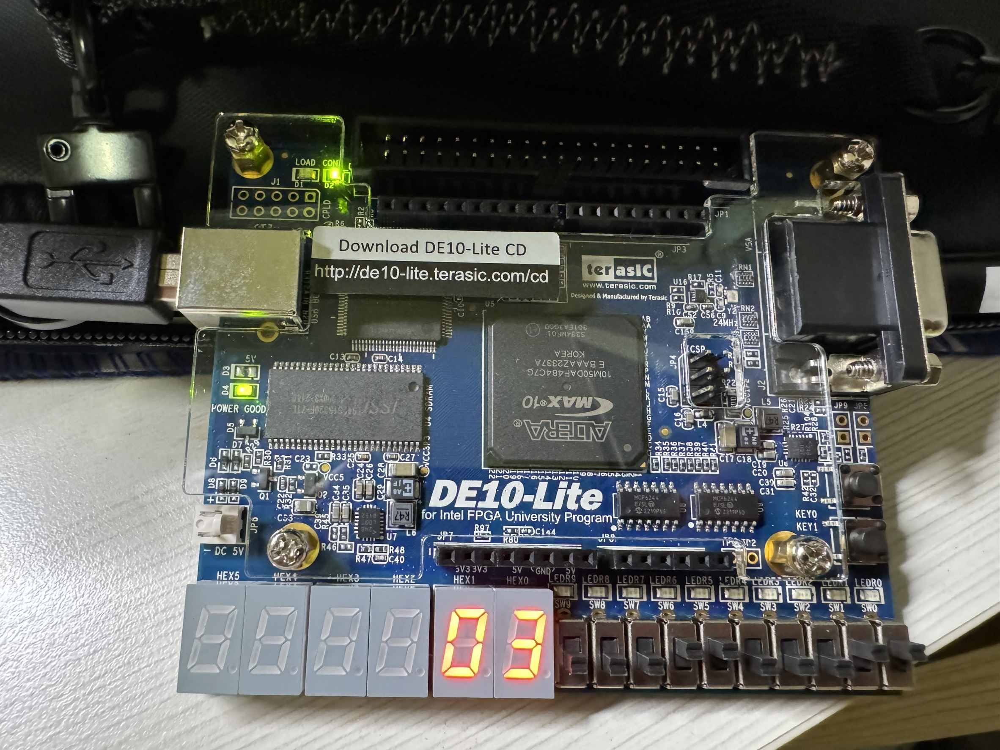
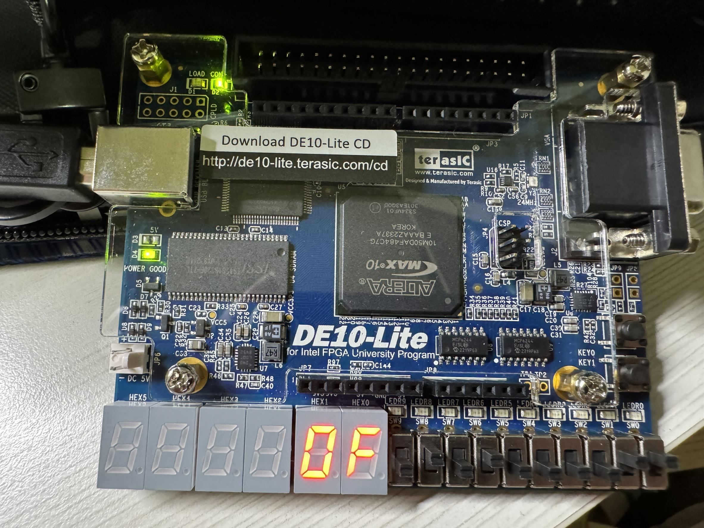
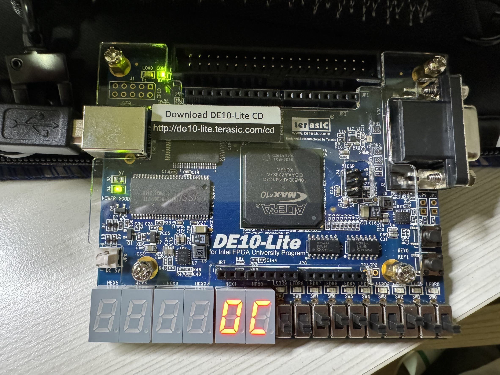
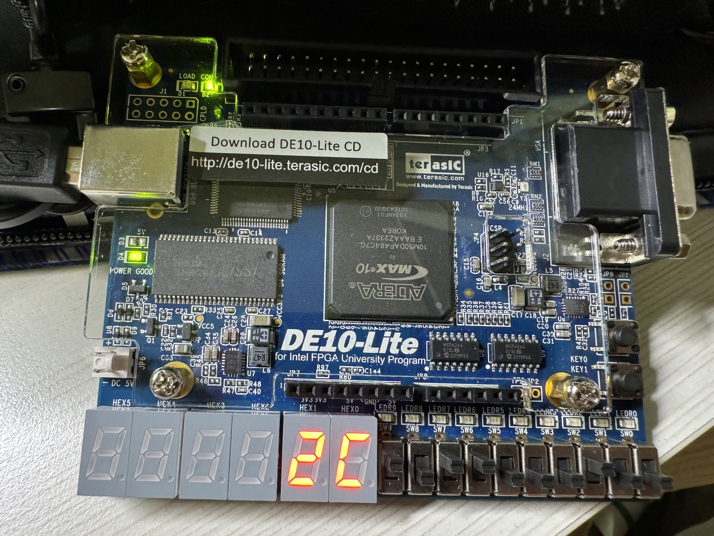
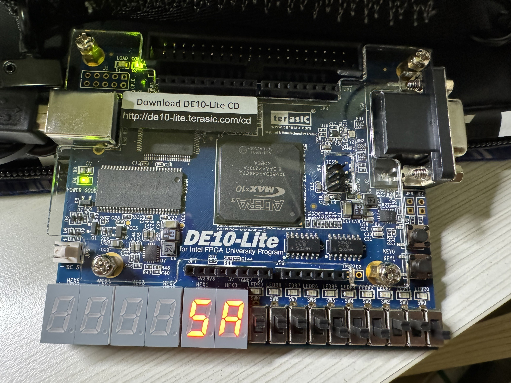
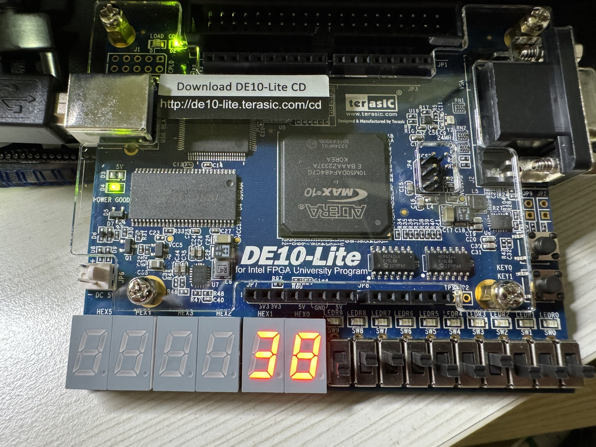

    <h1 align="center">4 bit Multiplier</h1>
    <h4 align="center">A Verilog exercise for 4 bit Multiplier design</strong> </h4>
    

        <strong>Last updated:</strong> 20 July 2024 
        <strong>Last tested version:</strong> 0720
    
 

# About the project
I referred to the Verilog tutorial from YouTuber Merak's channel.

