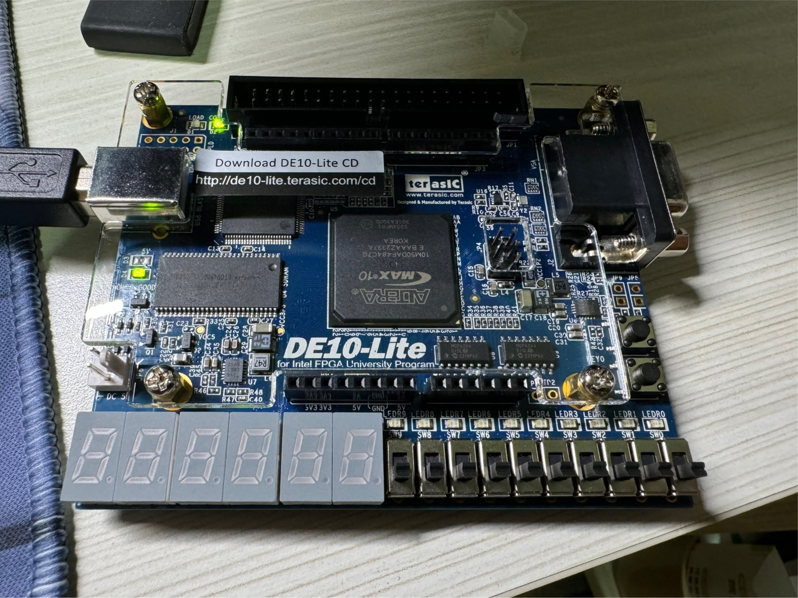
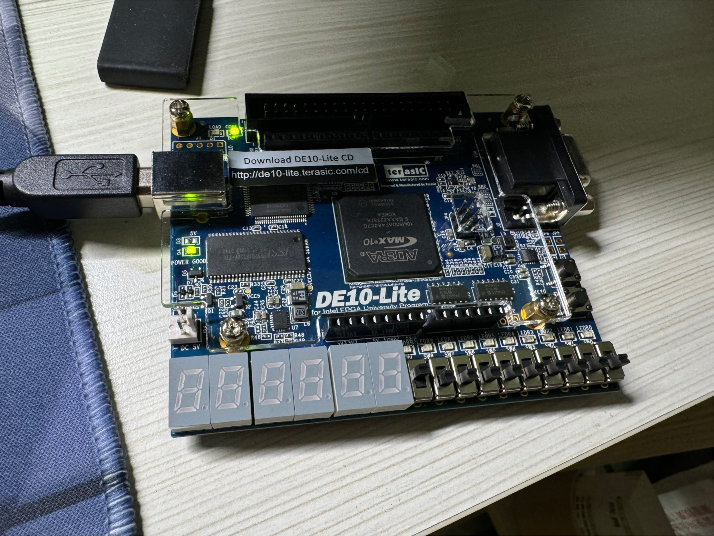
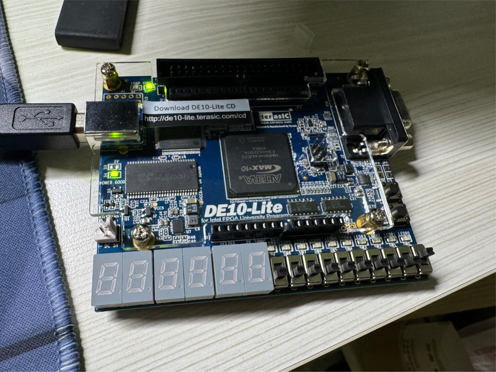
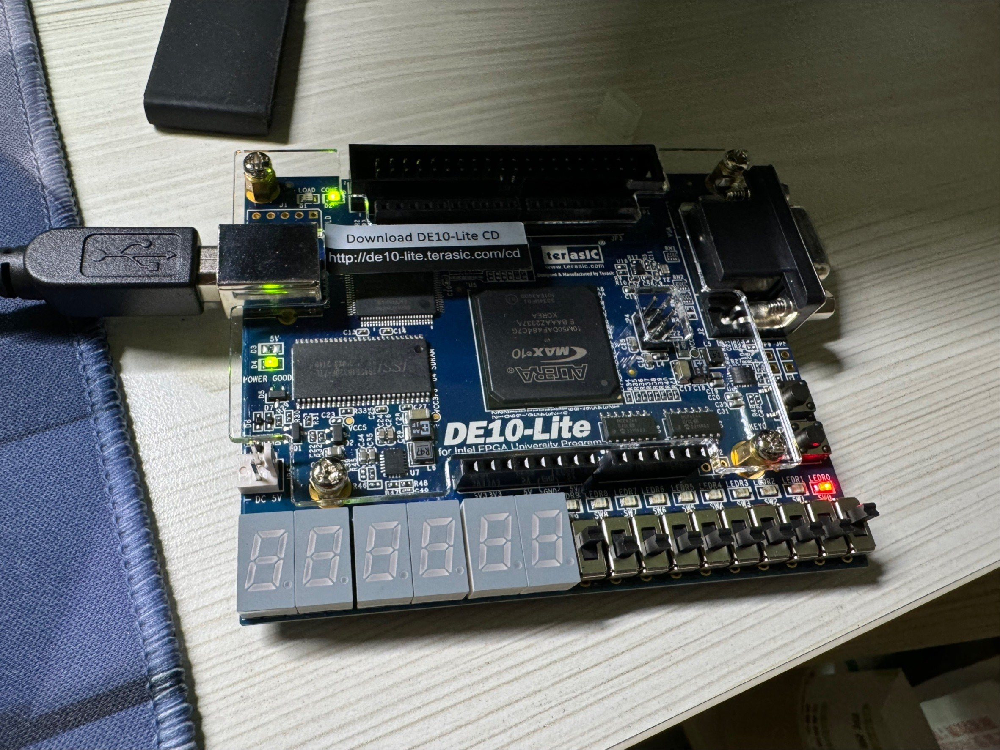
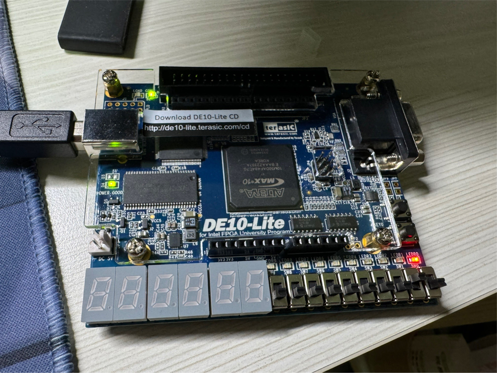
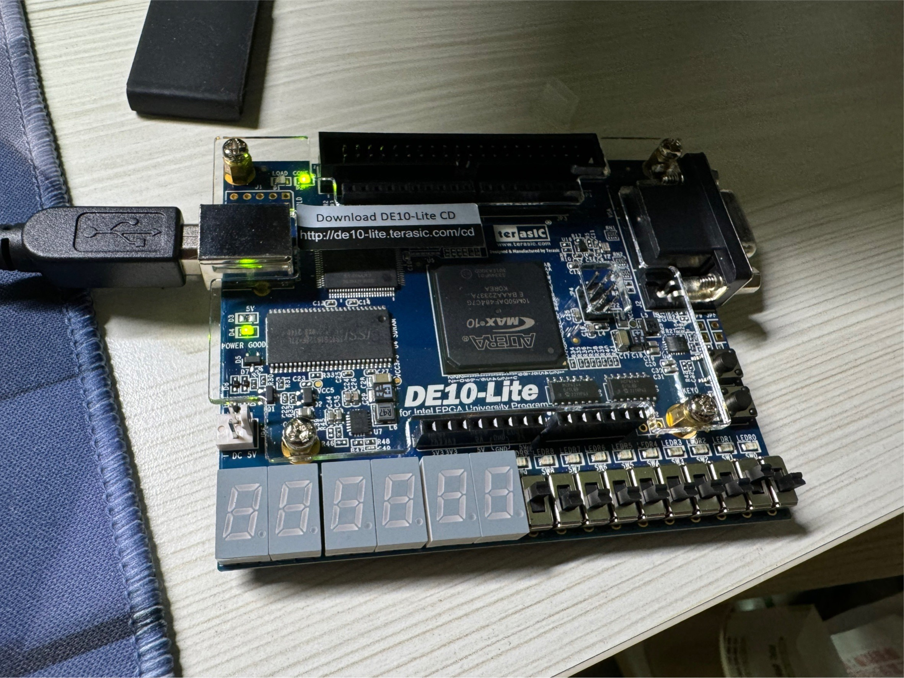
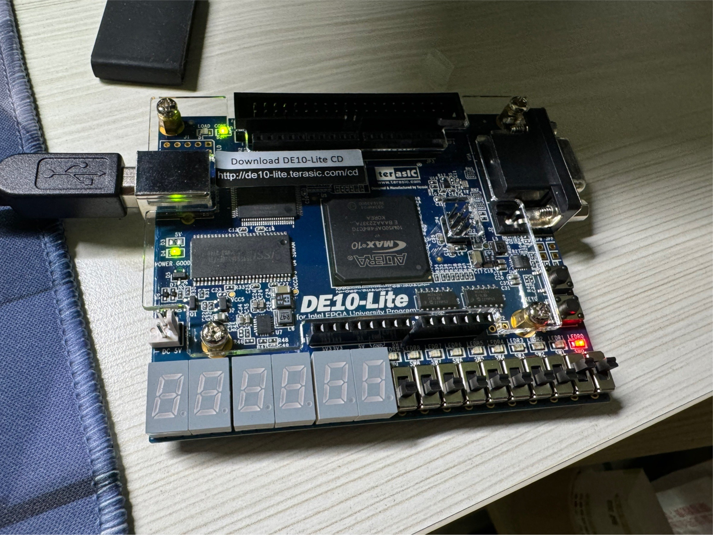
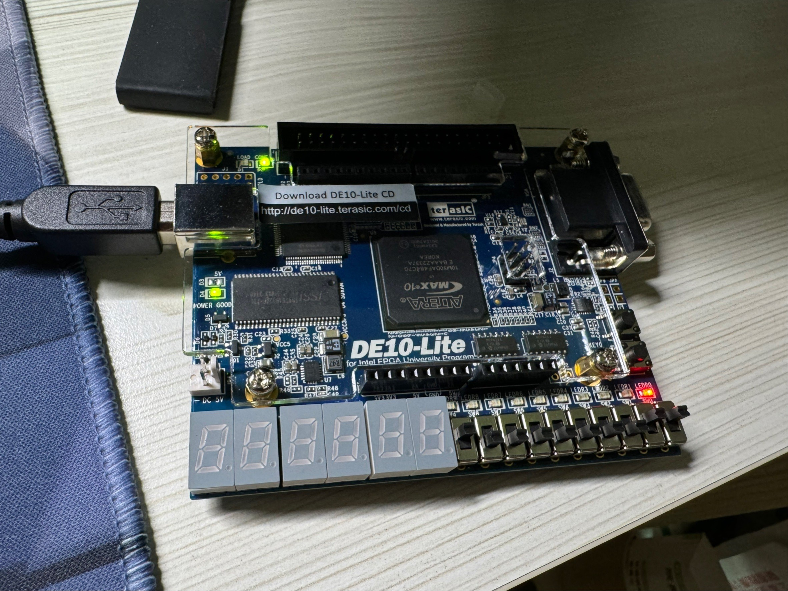
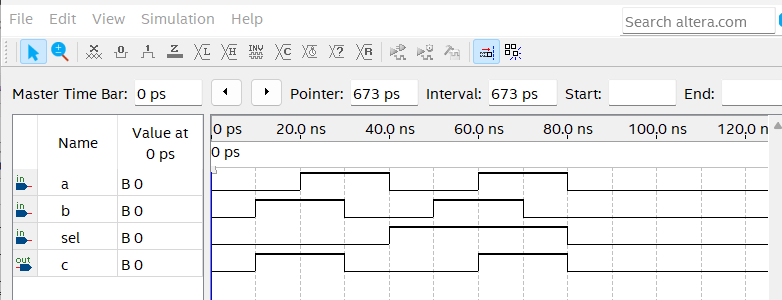

    <h1 align="center">MUX 2 to 1</h1>
    <h4 align="center">A Verilog exercise for MUX design</strong> </h4>
    

        <strong>Last updated:</strong> 15 June 2024 
        <strong>Last tested version:</strong> 0613
    
 

# About the project
I referred to the Verilog tutorial from YouTuber Merak's channel.

|     |  sel = 0   | sel = 1  |
|  :----:  |  :----:  | :----:  |
| a = 0,b = 0 |  |  |
| a = 1,b = 0 |  |  |
| a = 0,b = 1 |  |  |
| a = 1,b = 1 |  |  |

