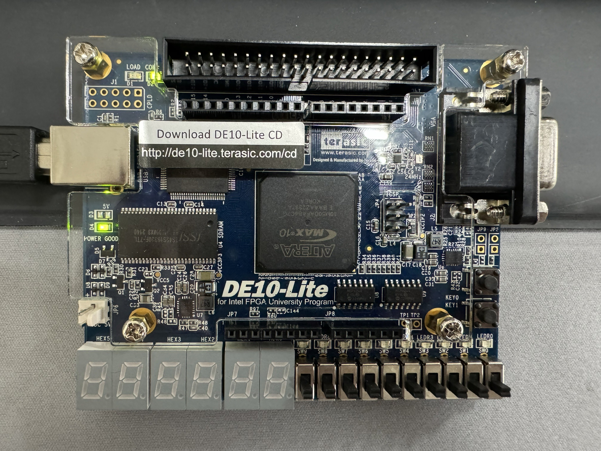
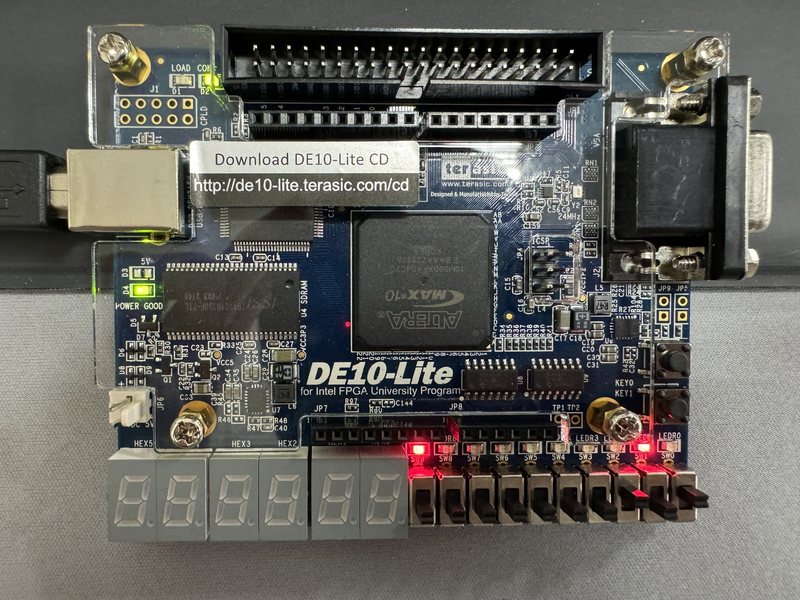
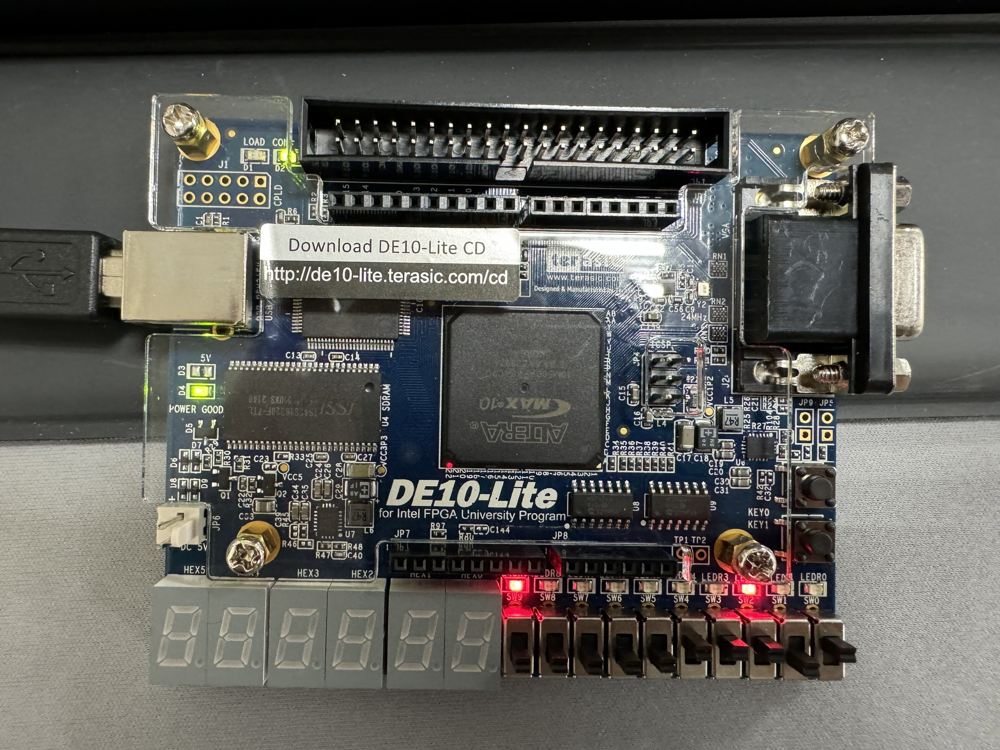
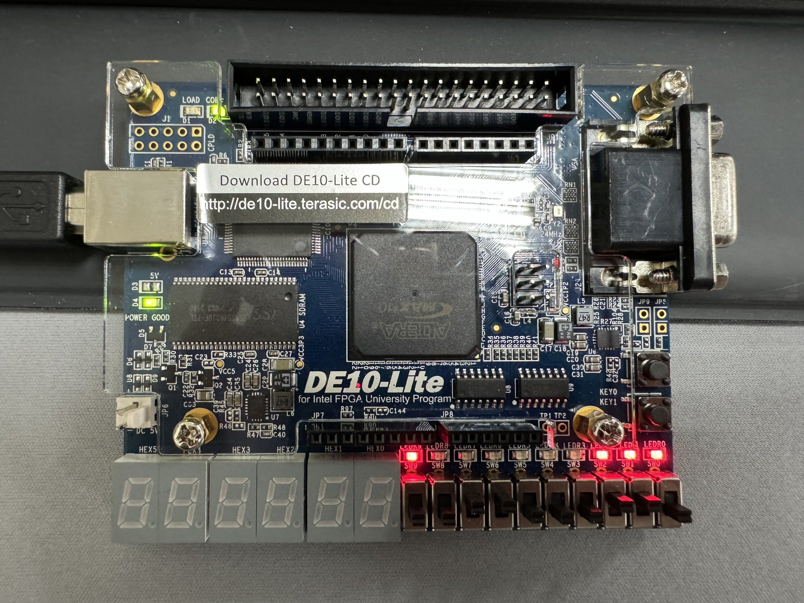

    <h1 align="center">4 bit Priority Encoder</h1>
    <h4 align="center">A Verilog exercise for 4 bit Priority Encoder design</strong> </h4>
    

        <strong>Last updated:</strong> 21 July 2024 
        <strong>Last tested version:</strong> 0721
    
 

# About the project
I referred to the Verilog tutorial from YouTuber Merak's channel.

* Din_0000_0000_Valid_0_Dout_0

* Din_0000_0101_Valid_1_Dout_2

* Din_0001_1101_Valid_1_Dout_4

* Din_1100_0110_Valid_1_Dout_7

