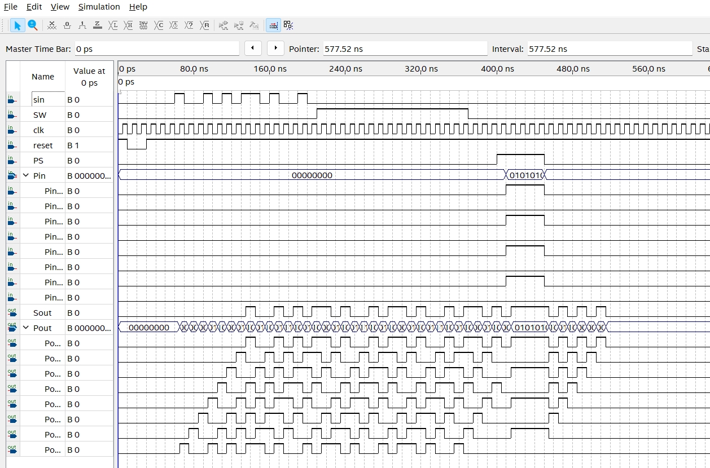

    <h1 align="center">PISO&PIPO</h1>
    <h4 align="center">A Verilog exercise for PISO and PIPO design</strong> </h4>
    

        <strong>Last updated:</strong> 20 Aug 2024 
        <strong>Last tested version:</strong> 0820
    
 

# About the project
I referred to the Verilog tutorial from YouTuber Merak's channel.

[PISO&PIPO](https://youtu.be/vMHGlfX1GTs)