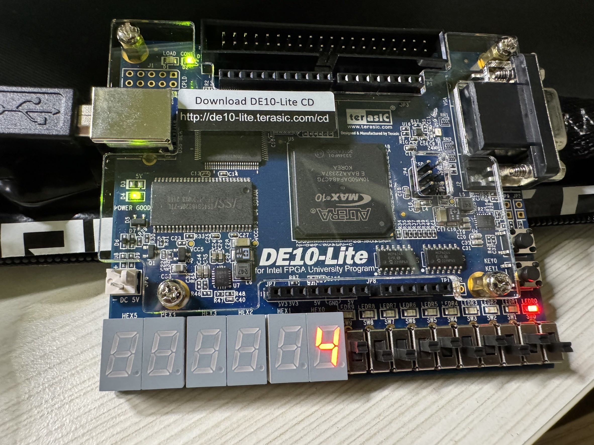

    <h1 align="center">RCA4</h1>
    <h4 align="center">A Verilog exercise for 4-bit Ripple Carry Adder on 7-Segment Display design</strong> </h4>
    

        <strong>Last updated:</strong> 21 June 2024 
        <strong>Last tested version:</strong> 0621
    
 

# About the project
I referred to the Verilog tutorial from YouTuber Merak's channel.

* A = 0000, B = 0000, Cin = 0, S=0

* A = 0101, B = 1010, Cin = 0, S=F

* A = 1010, B = 1001, Cin = 1, S=4
