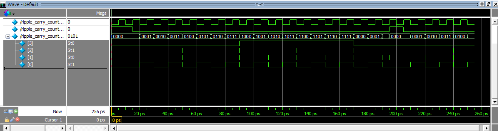
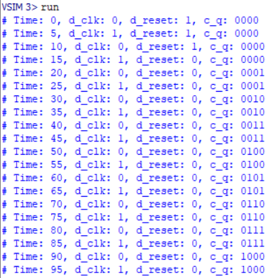
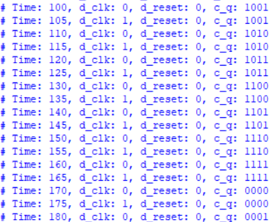
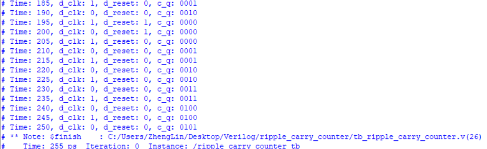

    <h1 align="center">Ripple_carry_counter</h1>
    <h4 align="center">A Verilog exercise for Ripple carry counter design</strong> </h4>
    

        <strong>Last updated:</strong> 17 June 2024 
        <strong>Last tested version:</strong> 0617
    
 

# About the project
I have implemented a 4-bit Ripple Carry Counter using D Flip-Flops and NOT gates.

