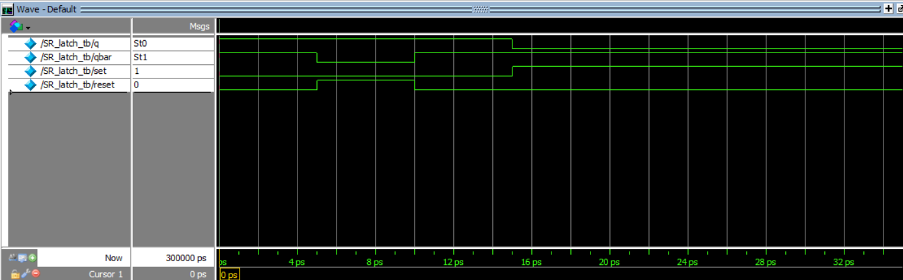
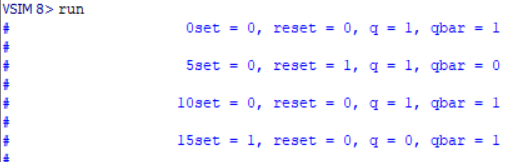

    <h1 align="center">SR latch</h1>
    <h4 align="center">A Verilog exercise for SR latch design</strong> </h4>
    

        <strong>Last updated:</strong> 16 June 2024 
        <strong>Last tested version:</strong> 0616
    
 

# About the project
The design of an SR latch, in which set and reset changes are made in SR_latch_tb.

