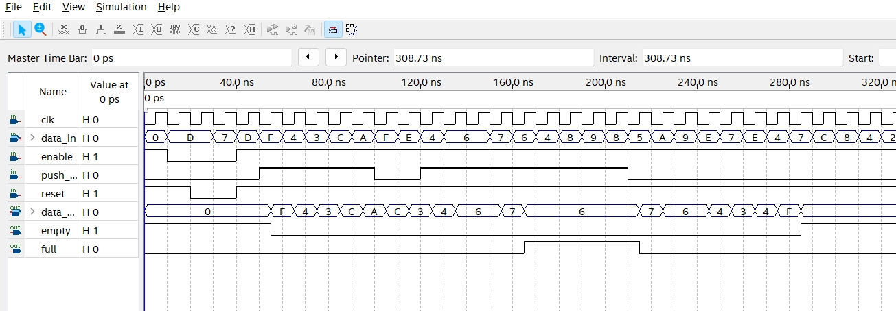

    <h1 align="center">Stack</h1>
    <h4 align="center">A Verilog exercise for Stack design</strong> </h4>
    

        <strong>Last updated:</strong> 25 Aug 2024 
        <strong>Last tested version:</strong> 0825
    
 

# About the project
I referred to the Verilog tutorial from YouTuber Merak's channel.

[Stack](https://youtu.be/zdsTVzvZN1w)